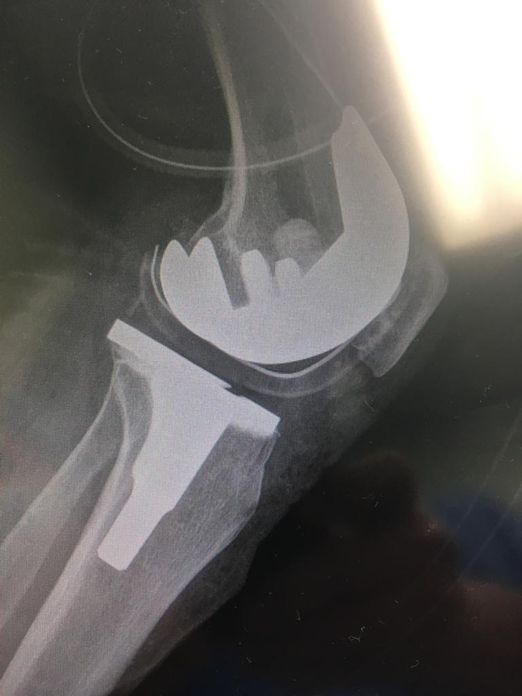
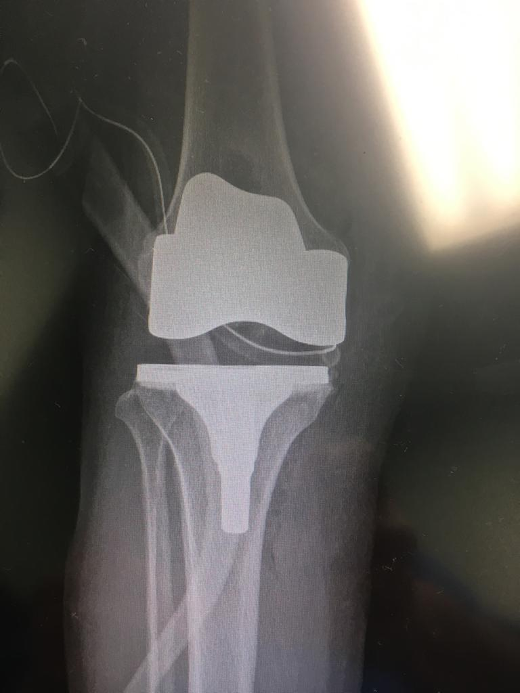
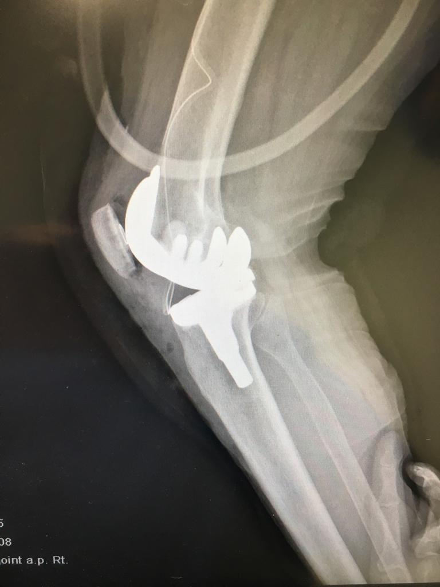
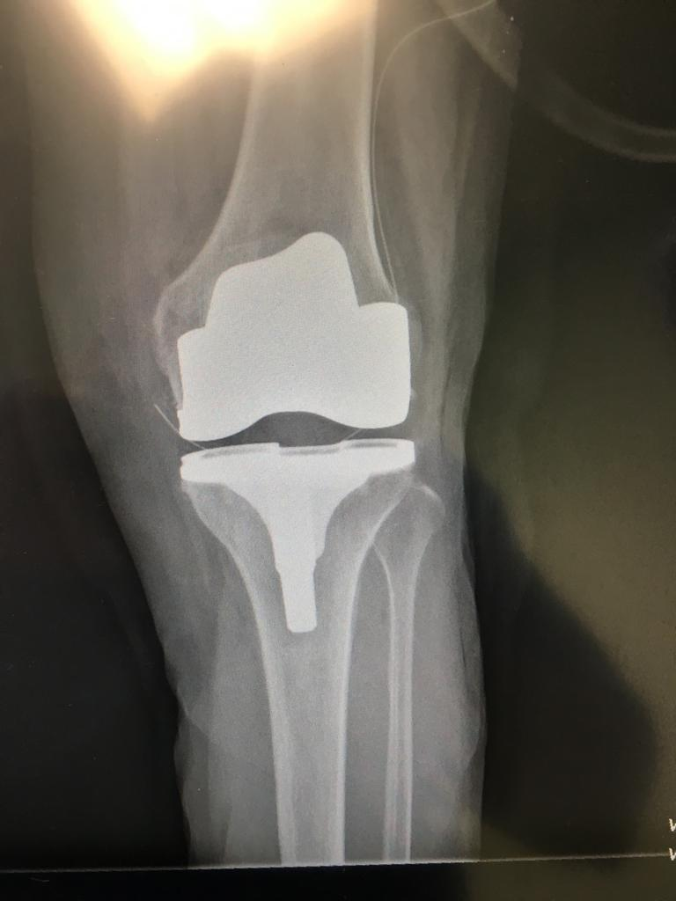

# Gonartrosis
Desgaste artícular de rodilla — es una enfermedad frecuente en pacientes adultos mayores. Generalmente degenerativa, esta enfermedad esta condicionada por la edad, el sobrepeso y enfermedades como la artritis reumatoide y puede también tener origen traumático.

# Síntomas
Condiciona dificultad para la marcha, dolor al subir y bajar escaleras, tronidos articulares, limitación de la movilidad y aumento de volumen de la rodilla.

Cuando el desgaste articular es severo condiciona deformidades de la rodilla y dolor que no cede con medicamentos.

# Diagnostico
Los Rayos X y la exploración física nos indican cuando hay que colocar una prótesis total de rodilla.

# Tratamiento
La prótesis total de rodilla es un implante metálico pegado al hueso que sustituye el cartílago articular gastado y favorece la movilidad de rodilla sin dolor.
