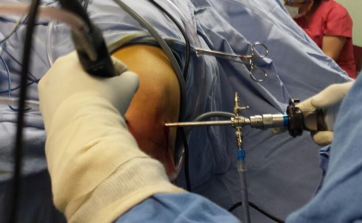
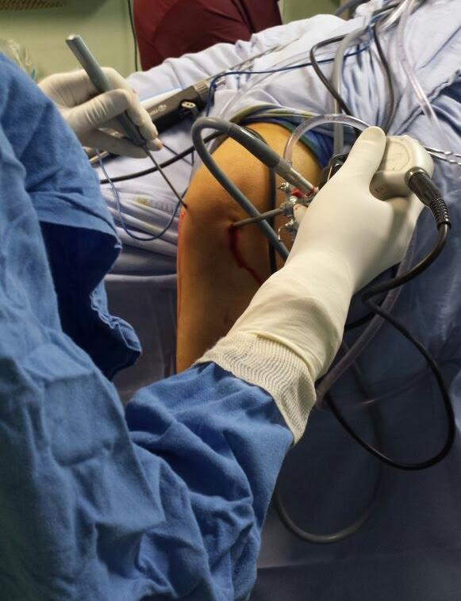

Es una técnica quirúrgica mediante la cual se tratan enfermedades de las articulaciones usando una cámara de televisión, que se introduce a través de pequeñas insiciones de un centímetro, con el uso de instrumental especializado, evitando así heridas de gran tamaño como las que se realizaba hace algunos años. De esta manera se permite una recuperación más rápida.

Generalmente es una cirugía ambulatoria (alta el mismo día de la cirugía).

# Indicaciones

- Enfermedades del cartílago articular secundarias a artritis reumatoide, osteoartritis, ácido úrico (gota) o secundaria a fracturas articulares.
- Lesiones meniscales
- Lesión de ligamentos cruzados
- Lesiones deportivas (fútbol, basquetbol, etc.)
- Fracturas articulares
- Luxaciones de rodilla
- Tumores óseos o articulares
- Alteración en la alineación de la rótula
- Infecciones articulares
